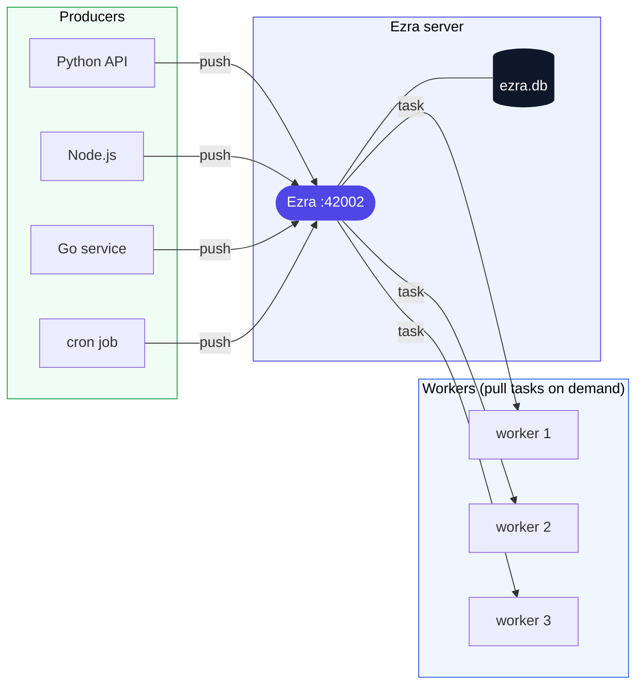

# **E**xchange via **Z**ero-loss **R**elay **A**gent


<p align="center">
  <a href="https://github.com/entGriff/ezra/actions/workflows/test.yml"></a>
  <a href="https://github.com/entGriff/ezra/releases"></a>
  <a href="https://github.com/entGriff/ezra/blob/main/LICENSE"></a>
</p>

EZRA is a persistent task queue. Multiple services push tasks in, multiple workers pull them out and confirm when done.
Each task stays visible and explicitly tracked until a worker marks it finished - no silent drops, no fire-and-forget. Backed by SQLite, powered by the Erlang/OTP runtime. Workers connect with any Redis client (Redis itself is not needed) in any language - no new SDK required.

> **This project is maintained by a single author and pull requests are not accepted. Issues for bugs or questions are welcome.**

---

## Contents

- [Quick start](#quick-start)
- [The big picture](#the-big-picture)
- [Why does this exist?](#why-does-this-exist)
- [How it works](#how-it-works)
- [Task lifecycle](#task-lifecycle)
- [Multiple workers and producers](#multiple-workers-and-producers)
- [Install](#install)
- [Run](#run)
- [Elixir](#elixir)
- [Terminology](#terminology)

---

## Quick start

```bash
docker run -d --name ezra \
  -p 42002:42002 \
  -v ezra_data:/data \
  ghcr.io/entgriff/ezra
```

That is the entire server setup. Now, from any machine that can reach that port:

**Producer** - push a task

```python
import redis

r = redis.Redis(host="localhost", port=42002, decode_responses=True)

# Push a task into the "emails" queue.
# Queues do not need to be created in advance - the first push creates one.
r.xadd("emails", {"payload": '{"to": "alice@example.com"}'})
```

**Worker** - pop and process tasks

```python
import redis

r = redis.Redis(host="localhost", port=42002, decode_responses=True)

while True:
    # Ask Ezra for the next task from "emails".
    # "workers"    - consumer group name, required by the Redis wire protocol but ignored by Ezra.
    # "worker-1"   - this specific worker's identity (each process needs a unique name).
    # {"emails": ">"} - give me the next undelivered task from this queue.
    # block=0      - wait indefinitely; Ezra delivers the task the moment one arrives.
    results = r.xreadgroup("workers", "worker-1", {"emails": ">"}, count=1, block=0)

    if results:
        _, [(task_id, fields)] = results[0]

        send_email(fields["payload"])  # your processing code here

        # Acknowledge success. Without this, Ezra re-delivers the task after the
        # visibility timeout (default 30 seconds).
        r.xack("emails", "workers", task_id)
```

Any language with a Redis client works the same way - Python, Node.js, Go, Ruby, Java. Point the client at port 42002 instead of Redis.

---

## The big picture



Services and workers can run on any machine in any language. Workers actively pull tasks when ready - Ezra delivers one immediately if available, or holds the connection until one arrives. Everything persists to `ezra.db` on the server.

| | |
|---|---|
| Memory per connected worker | ~2 KB (not an OS thread) |
| Memory baseline | ~20 MB |
| Throughput on a typical cloud VM (SSD) | ~15k–30k tasks/sec |
| Throughput on NVMe | ~40k–80k tasks/sec |
| Binary size | ~20 MB, self-contained |

Throughput is bounded by SQLite write speed, which depends on the disk. The engine itself adds ~1–5 µs overhead per call.

---

## Why does this exist?

Your user sends any requests to your API which needs to be processed, let's say uploads PDF. You can do some processing inline in the request handler, but then your API blocks for 10 seconds, the user stares at a spinner, and if your process restarts mid-job, or you will release new deployment the work is silently lost.

You also are not able to upscale only the processing part, you need to upscale the entire API cause it is tightly coupled with the request handling logic.

A task queue fixes this: the upload handler pushes a task and returns immediately. A separate worker picks it up, does the heavy lifting, and confirms when done. Tasks survive restarts. Failures retry automatically.

There are amazing queues out there - Kafka, RabbitMQ, ActiveMQ, SQS, and many more. But most of them are resource-heavy, expensive, and time-consuming to run properly. You need a cluster, dedicated machines, and someone or sometimes a team who understands the operational model well enough to set it up properly and recover the system when things break. Managed options cut the ops burden but add a monthly subscription and lock you into one cloud vendor.

The result: most teams skip persistent queuing entirely and use in-memory jobs that quietly lose work on restart and are fragile. The trade-off exists because the alternative felt too heavy.

EZRA is the alternative that does not feel heavy. One binary, no cluster, no setup. It stores everything in a SQLite file on the same machine it runs on. Workers connect with whatever Redis client your team already has, in any language. No broker to babysit, no cluster to setup, no topics to define, no queue to configure before you can use it.

One binary - you just run it and can actually touch the data anytime you want.

---

## How it works

EZRA speaks the same **wire protocol** that Redis uses - a simple text format called RESP. Every Redis client library in every language already knows how to speak it. Since EZRA understands the same format, those libraries work with EZRA without modification. You just point the client at a different port.

The specific commands EZRA implements come from **Redis Streams** - the part of Redis built around the idea that a message must be explicitly acknowledged before it is considered done:

- **XADD** - push a task into a named queue
- **XREADGROUP** - pop the next task and claim it under a worker identity; supports blocking so workers do not need to poll
- **XACK** - confirm that a task was processed successfully
- **XDEL** - report failure; EZRA returns the task for retry instead of deleting it
- **XNACK** - same as XDEL, for clients whose SDK can send arbitrary commands directly

Everything else Redis supports (`GET`, `SET`, pub/sub, etc.) returns an error. EZRA is not trying to be Redis.

---

## Task lifecycle

```mermaid
stateDiagram-v2
    [*] --> available : push
    available --> in_flight : pop
    in_flight --> available : crash, timeout, or nack with retries left
    in_flight --> done : ack
    in_flight --> dead : nack or timeout, no retries left
    dead --> [*] : readable via queue&#58;&#58;dead
```



**Tasks are never silently lost.** A task stays in the queue until a worker explicitly says it is done. If EZRA itself restarts, all in-flight tasks return to available automatically.

**After a nack, can the same worker get the same task again?** Yes. When a task is nacked it returns to `available` and the next pop - from any worker, including the same one - can claim it. If you want to avoid tight retry loops, add a short sleep in your worker between a failure and the next pop. The `last_error` field stores the nack reason for inspection.

---

## Multiple workers and producers

EZRA exposes a network API over TCP. Any machine that can reach the port can push tasks or pop them. No registration, no configuration per client - just connect and use. See [The big picture](#the-big-picture) for a visual overview.

- Any number of producer clients can push to the same queue simultaneously
- Any number of worker clients can pop from the same queue - each task goes to exactly one worker, never duplicated
- Workers are identified by a unique name you provide (`worker-1`, `worker-2`, etc.) - EZRA uses this to track which tasks are in-flight for which process
- Blocking pop holds the connection open and delivers a task the moment one arrives - no polling loop needed

Work distributes on demand: whichever worker finishes first asks for the next task and gets it immediately. Scale by running more workers - no coordination needed, no configuration changes in EZRA.

**A note on SQLite and remote access.** Nobody connects to SQLite remotely. Only EZRA's internal engine touches the file, on the same machine where EZRA runs. External clients talk to EZRA over TCP. The real constraint is that EZRA itself is single-node: all data lives on the one machine where it runs.

---

## Install

> Prebuilt binaries: [github.com/entGriff/ezra/releases](https://github.com/entGriff/ezra/releases)
>
> Prefer containers? See [Docker in docs/usage.md](docs/usage.md#docker).

```bash
# macOS (Apple Silicon)
curl -Lo ezra https://github.com/entGriff/ezra/releases/latest/download/ezra-macos_arm64
chmod +x ezra

# Linux x86_64
curl -Lo ezra https://github.com/entGriff/ezra/releases/latest/download/ezra-linux_x86_64
chmod +x ezra

# Linux arm64
curl -Lo ezra https://github.com/entGriff/ezra/releases/latest/download/ezra-linux_arm64
chmod +x ezra
```

No runtime required. The binary is self-contained (~20 MB).

---

## Run

```bash
./ezra --data-dir /var/ezra
```

EZRA creates `ezra.db` in the data directory on first run. On every subsequent start it opens the existing file - your tasks are exactly where you left them.

Options can also be set via environment variables:

```bash
EZRA_DATA_DIR=/var/ezra EZRA_PORT=42002 ./ezra
```

Send `SIGTERM` or press `Ctrl+C` to stop. EZRA finishes any in-progress operations and shuts down cleanly.

For the full options reference, Docker deployment examples, language client snippets, and systemd setup see [docs/usage.md](docs/usage.md).

---

## Elixir

If you are building an Elixir application, EZRA can run embedded inside your own process - no TCP hop for your own workers.

```elixir
# mix.exs
{:ezra, "~> 0.1"}

# application.ex
children = [
  {Ezra, name: :ezra, data_dir: "priv/ezra"}
]
```

```elixir
# direct in-process call, no network
{:ok, id}   = Ezra.push(:ezra, "emails", payload)
{:ok, task} = Ezra.pop(:ezra, "emails", worker_id: "w1", block: 30_000)
:ok         = Ezra.ack(:ezra, task.id)
```

See [docs/elixir-client.md](docs/elixir-client.md) for the full guide.

---

## Terminology

**push** - add a new task to a queue.

**pop** - take the next task to work on. The task is not deleted - it is temporarily checked out. You must confirm when done.

**ack** (acknowledge) - tell EZRA "I finished this task." It is marked `done` and will not be given to anyone else. Done tasks stay in the database - they accumulate over time unless you configure `--retention-seconds` on the queue or push tasks with a `ttl_seconds` option.

**nack** (negative acknowledge) - tell EZRA "I failed." EZRA puts it back for another worker to try, up to `max_attempts` times.

**in_flight** - a task that has been popped but not yet acknowledged. If the worker goes silent, EZRA reclaims it after `visibility_timeout` seconds.

---

## Further reading

- [docs/usage.md](docs/usage.md) - language clients, full usage examples, Docker, options reference, systemd
- [docs/architecture.md](docs/architecture.md) - storage schema, module map, wire protocol, telemetry
- [docs/elixir-client.md](docs/elixir-client.md) - Elixir library mode reference
