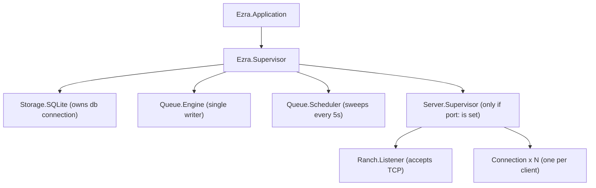
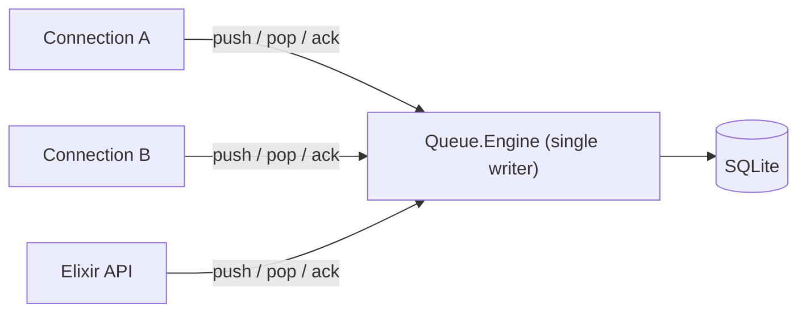
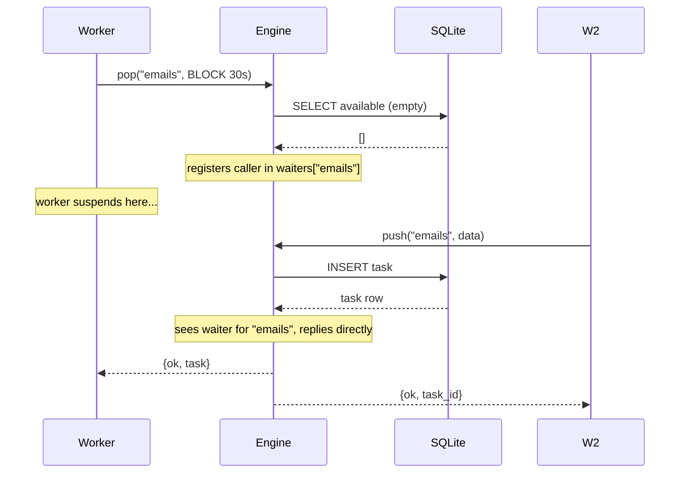
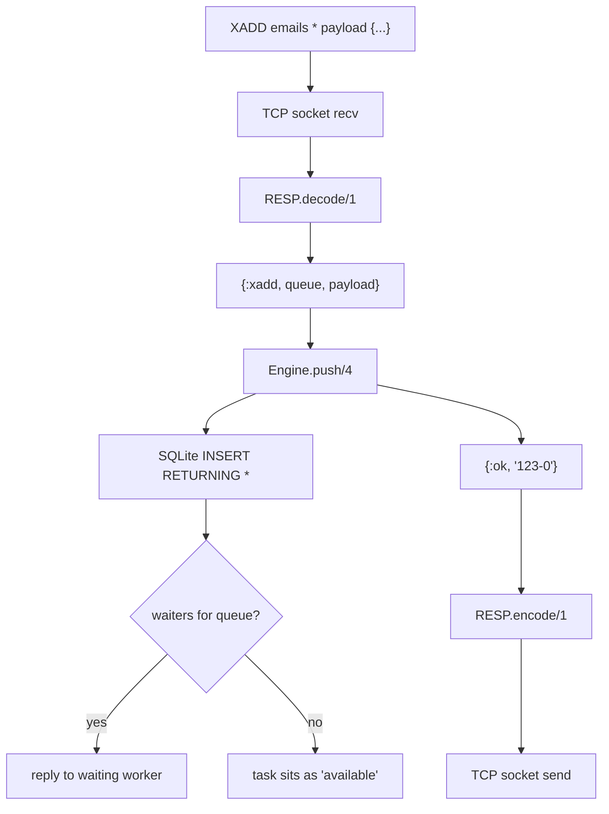
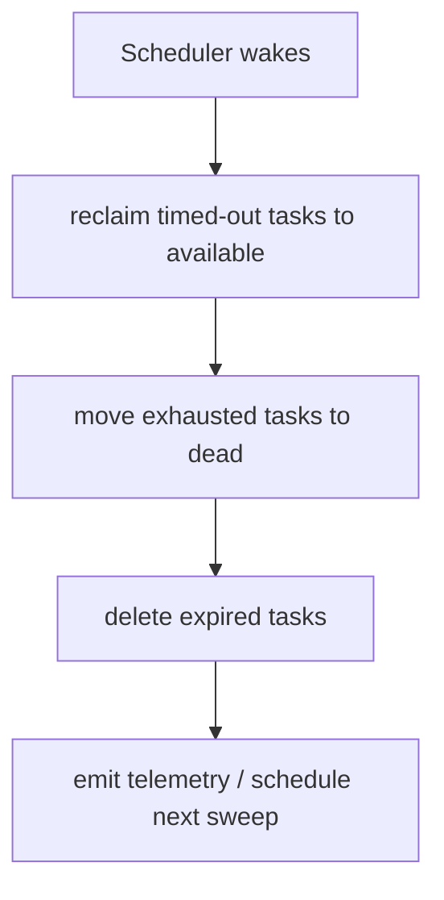

# EZRA - Architecture

System design, data flows, storage schema, wire protocol, and module reference for contributors.

---

## Supervision tree

Every component is a supervised process. A crash in any one is isolated and restarted without affecting the others.



**Why Server.Supervisor is conditional:** In Elixir library mode where all workers are in the same process, there is no need to open a TCP port or run a connection handler. If `port:` is not configured, `Server.Supervisor` is simply not added to the supervision tree at all - no OS port is allocated, no memory for connection processes, no Ranch dependency started. The entire TCP stack is skipped. You only pay for what you use.

---

## What lives in SQLite vs what lives in the Engine

This is an important distinction.

**SQLite stores all persistent state:**

- The `queues` table: queue names and their configuration (visibility_timeout, max_attempts, retention_seconds)
- The `tasks` table: every task ever pushed - payload, current status, attempts, worker_id, timestamps, error messages

If EZRA restarts, all of this survives. Nothing is lost.

**The Engine stores one thing in memory: the waiters map.**

The waiters map tracks workers that are currently blocked waiting for a task (those that called pop on an empty queue with BLOCK). It looks like this:

```
waiters = %{
  "emails"   => [{worker_A_pid, timer_ref, "worker-1"}, ...],
  "invoices" => [{worker_B_pid, timer_ref, "worker-2"}]
}
```

This is transient. If EZRA restarts, the waiters map is gone. Workers that were blocking will hit their timeout and reconnect. No task data is lost - only the in-memory "who is currently waiting" list. Workers will automatically reconnect and start blocking again.

Everything else - queue configuration, task state, retry counts - is in SQLite and survives restarts completely.

---

## Single writer guarantee

All mutations (push, pop, ack, nack) go through `Queue.Engine` as serialized calls. It is the only process that writes to SQLite. This eliminates the entire class of concurrent write bugs.



**Is this a bottleneck?** No. SQLite itself only allows one writer at a time regardless - that is a property of the database, not something we added. The Engine makes this coordination explicit and adds roughly 1–5 microseconds of overhead per call, which is negligible. The real throughput ceiling is SQLite's write speed - ~15k–30k ops/sec on a typical cloud SSD - which the Engine does not affect.

---

## Blocking pop

When a worker pops with an empty queue and `BLOCK ms > 0`, Engine does not reply. It stores the caller in the in-memory waiters map. When the next push arrives for that queue, Engine replies directly to the waiting caller - no polling, no second database read.



---

## Push data flow



---

## Task lifecycle

```mermaid
stateDiagram-v2
    [*] --> available : push()
    available --> in_flight : pop()
    in_flight --> available : nack() or timeout, retries left
    in_flight --> done : ack()
    in_flight --> dead : nack() or timeout, no retries left
    dead --> [*] : accessible via queue&#58;&#58;dead
```



---

## Scheduler sweep (every 5s)



---

## Wire protocol

EZRA implements the Redis Streams subset of RESP2. Any Redis client works without modification.

| Command                                                                    | Semantics                                                                                           |
| -------------------------------------------------------------------------- | --------------------------------------------------------------------------------------------------- |
| `XADD <queue> * payload <data>`                                            | Push a task. Creates the queue on first use.                                                        |
| `XREADGROUP GROUP <g> <consumer> COUNT <n> [BLOCK <ms>] STREAMS <queue> >` | Pop up to `n` tasks. Blocks up to `ms` ms if queue is empty.                                        |
| `XACK <queue> <group> <id>`                                                | Acknowledge. Marks task `done`.                                                                     |
| `XDEL <queue> <id>`                                                        | Nack via standard Redis command. Returns task for retry; moves to dead if attempts are exhausted. EZRA repurposes this - it does not hard-delete. |
| `XNACK <queue> <group> <id>`                                               | Same as XDEL. For clients whose SDK supports sending arbitrary commands directly.                   |
| `CLIENT SETNAME <name>`                                                    | Accepted as a no-op. Allows any Redis SDK to connect without errors.                                |
| `XGROUP CREATE <queue> <group> $ MKSTREAM`                                 | Pre-create a queue. Optional - XADD does it automatically.                                          |
| `XLEN <queue>`                                                             | Count of `available` tasks.                                                                         |
| `XINFO STREAM <queue>`                                                     | Full queue stats: depth, in-flight, dead, last entry.                                               |

---

## Storage schema

```sql
CREATE TABLE queues (
  name                TEXT    PRIMARY KEY,
  max_attempts        INTEGER NOT NULL DEFAULT 3,
  visibility_timeout  INTEGER NOT NULL DEFAULT 30,   -- seconds
  retention_seconds   INTEGER,                        -- NULL = keep forever
  created_at          INTEGER NOT NULL               -- Unix microseconds
);

CREATE TABLE tasks (
  id                  INTEGER PRIMARY KEY AUTOINCREMENT,
  queue               TEXT    NOT NULL REFERENCES queues(name),
  payload             BLOB    NOT NULL,
  status              TEXT    NOT NULL DEFAULT 'available',
  -- 'available' | 'in_flight' | 'done' | 'dead'
  attempts            INTEGER NOT NULL DEFAULT 0,
  max_attempts        INTEGER NOT NULL DEFAULT 3,
  inserted_at         INTEGER NOT NULL,
  scheduled_at        INTEGER NOT NULL,
  claimed_at          INTEGER,
  worker_id           TEXT,
  visibility_timeout  INTEGER NOT NULL DEFAULT 30,
  expires_at          INTEGER,
  last_error          TEXT
);

-- drives every pop query
CREATE INDEX idx_tasks_available ON tasks (queue, scheduled_at)
  WHERE status = 'available';

-- drives the scheduler timeout sweep
CREATE INDEX idx_tasks_in_flight ON tasks (claimed_at)
  WHERE status = 'in_flight';
```

### SQLite runtime configuration

Applied once at startup on every connection:

```sql
PRAGMA journal_mode = WAL;
-- Allows concurrent reads while a write is in progress.
-- Without this, every read blocks during a write.

PRAGMA synchronous = NORMAL;
-- Fsyncs on WAL checkpoint, not after every write.
-- Survives OS crashes. Acceptable risk on power loss for a queue workload.
-- 2-5x faster than FULL with no meaningful downside for most deployments.

PRAGMA foreign_keys = ON;
-- Enforces tasks.queue -> queues.name. No performance cost.

PRAGMA busy_timeout = 5000;
-- Wait up to 5 seconds on lock contention instead of erroring immediately.

PRAGMA cache_size = -65536;
-- 64 MB page cache. Default is ~2 MB, which gets exhausted quickly once
-- the queue grows past a few thousand rows and the index no longer fits.
-- 64 MB costs nothing meaningful on any server and keeps the hot index
-- resident in memory, making every pop query a pure in-memory lookup.
```

---

## Useful SQL queries

Run these directly in any SQLite browser (DB Browser, TablePlus, etc.) against `ezra.db`.

**Current queue stats - all queues in one query:**

```sql
SELECT
    queue,
    COUNT(*) FILTER (WHERE status = 'available')  AS available,
    COUNT(*) FILTER (WHERE status = 'in_flight')  AS in_flight,
    COUNT(*) FILTER (WHERE status = 'done')        AS done,
    COUNT(*) FILTER (WHERE status = 'dead')        AS dead,
    COUNT(*)                                        AS total
FROM tasks
GROUP BY queue
ORDER BY queue;
```

**Tasks currently being processed (in-flight), with how long they've been claimed:**

```sql
SELECT
    id,
    queue,
    worker_id,
    attempts,
    ROUND((julianday('now') - julianday(claimed_at / 1000000.0, 'unixepoch')) * 86400) AS seconds_in_flight,
    visibility_timeout,
    payload
FROM tasks
WHERE status = 'in_flight'
ORDER BY claimed_at ASC;
```

**Tasks that are stuck (in-flight longer than their visibility timeout):**

```sql
SELECT id, queue, worker_id, attempts, max_attempts
FROM tasks
WHERE status = 'in_flight'
  AND (claimed_at + (visibility_timeout * 1000000)) < (strftime('%s', 'now') * 1000000);
```

**Dead tasks with their last error:**

```sql
SELECT id, queue, attempts, max_attempts, last_error, datetime(inserted_at / 1000000, 'unixepoch') AS inserted
FROM tasks
WHERE status = 'dead'
ORDER BY id DESC
LIMIT 50;
```

---

## Telemetry

| Event                        | When                           | Measurements  | Metadata                                   |
| ---------------------------- | ------------------------------ | ------------- | ------------------------------------------ |
| `[:ezra, :task, :pushed]`    | Task inserted                  | `%{count: 1}` | `%{queue:, task_id:, engine:}`             |
| `[:ezra, :task, :popped]`    | Task claimed by a worker       | `%{count: 1}` | `%{queue:, task_id:, worker_id:, engine:}` |
| `[:ezra, :task, :acked]`     | Task completed                 | `%{count: 1}` | `%{task_id:, engine:}`                     |
| `[:ezra, :task, :timed_out]` | Scheduler reclaims stuck tasks | `%{count: n}` | `%{engine:}`                               |
| `[:ezra, :task, :dead]`      | Task exhausted max attempts    | `%{count: 1}` | `%{task_id:, queue:, engine:}`             |

```elixir
:telemetry.attach("metrics", [:ezra, :task, :pushed], fn _event, %{count: n}, meta, _ ->
  MyMetrics.increment("ezra.pushed", tags: ["queue:#{meta.queue}"])
end, nil)
```

---

## Module map

| Module                    | Role                                                                             |
| ------------------------- | -------------------------------------------------------------------------------- |
| `Ezra`                    | Public API: `push/4`, `pop/3`, `ack/2`, `nack/3`, `queue_info/2`, `child_spec/1` |
| `Ezra.Supervisor`         | Wires all children. Entry point for both library and standalone modes.           |
| `Ezra.Config`             | Validated config struct. Resolves opts > env vars > defaults.                    |
| `Ezra.Queue.Engine`       | The brain. Single GenServer. All mutations route through here.                   |
| `Ezra.Queue.Task`         | Struct mirroring the tasks schema. State machine transition guards.              |
| `Ezra.Queue.Scheduler`    | Wakes every 5s. Reclaims timed-out tasks. Expires TTL tasks.                     |
| `Ezra.Storage.SQLite`     | GenServer wrapping the SQLite connection. Sets WAL pragmas. Runs migrations.     |
| `Ezra.Storage.Migrations` | Versioned SQL migration definitions. Applied on startup. Never destructive.      |
| `Ezra.Server.Supervisor`  | Started only when `port:` is set. Owns the TCP listener and connection pool.     |
| `Ezra.Server.Connection`  | One per TCP connection. Parses RESP → Engine → encodes → sends.                  |
| `Ezra.Server.RESP`        | Pure module. Stateless RESP2 encoder/decoder. No side effects.                   |
| `Ezra.CLI`                | Parses flags and env vars for standalone mode.                                   |
| `Ezra.Application`        | OTP entry point. Detects standalone vs library mode.                             |

---

## Performance

- **Memory per worker connection:** ~2KB (Erlang process, not an OS thread)
- **Memory baseline:** ~20MB
- **Throughput ceiling:** SQLite's write speed, which is hardware-dependent:
  - NVMe SSD: ~40k–80k ops/sec
  - SATA SSD / typical cloud VM: ~15k–30k ops/sec
  - Network-attached storage (EBS, etc.): ~3k–8k ops/sec
  - HDD: ~1k–2k ops/sec
- **Engine overhead:** ~1–5µs per call - not the bottleneck

